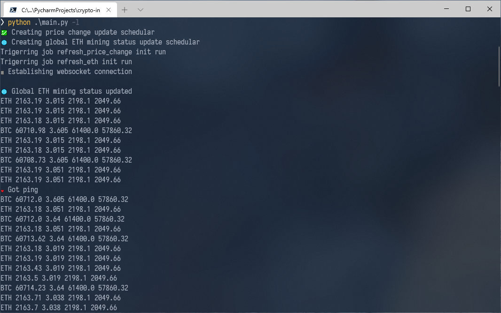
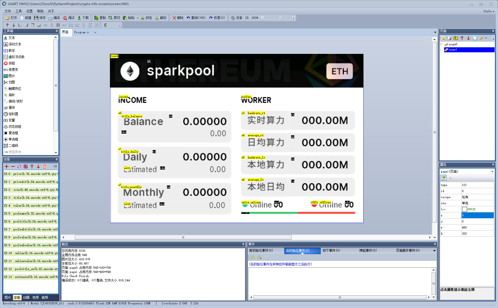

# A project to show realtime cryptocurrency price info in HMI USART screen

Now, you don't have to take your phone, open a cryptocurrency market app and wait for seconds until you can check the price. Just simply look at your table:


This project fetch data from both Huobi (using WebSocket) and Binance (using HTTP request), and update to HMI real-time.

Note: both of those market blocked requests from Mainland China IP

---

## Hardware

- Raspberry Pi 3 series (or any Linux Devboard)
- HMI UART Enhanced Screen (TJC-4832K035-011R)

## Installation

For Respberry Pi 3 Series, you need to enable GPIO serial Port to make it works. Otherwise, a CH340 USBTTL also works at any platform, just simply modify serial port name using ```-s``` argument.

```
pip3 install -r requirements.txt
python3 main.py
```

Reference: https://blog.csdn.net/m0_37509650/article/details/85403217

## Usage

```
usage: main.py [-h] [-s SERIAL] [-l] [-v] [--serial-debug]

optional arguments:
  -h, --help            show this help message and exit
  -s SERIAL, --serial SERIAL
                        serial port location, default is /dev/ttyAMA0
  -l, --list-only       only print information rather than sending to serial port
  -v, --verbose         print data from websocket
  --serial-debug        show commands that sent to serial port
```

## Example

```
python .\main.py -l
```


## UI

You can change screen UI by modifying ```screen.HMI``` using USART HMI



Reference: http://wiki.tjc1688.com/doku.php?id=start

---

## Thanks

- Myself
- Weipu Liu